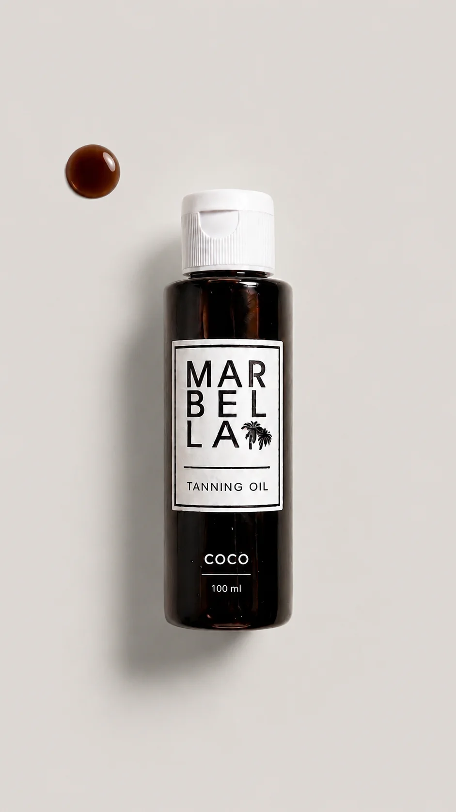
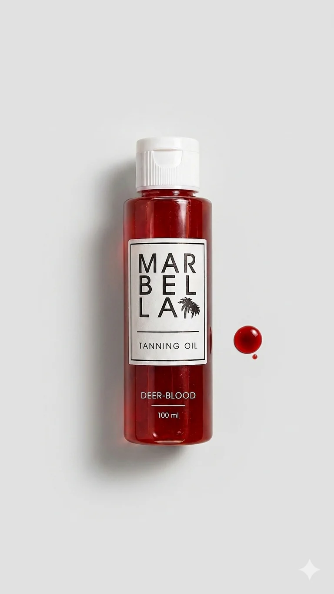
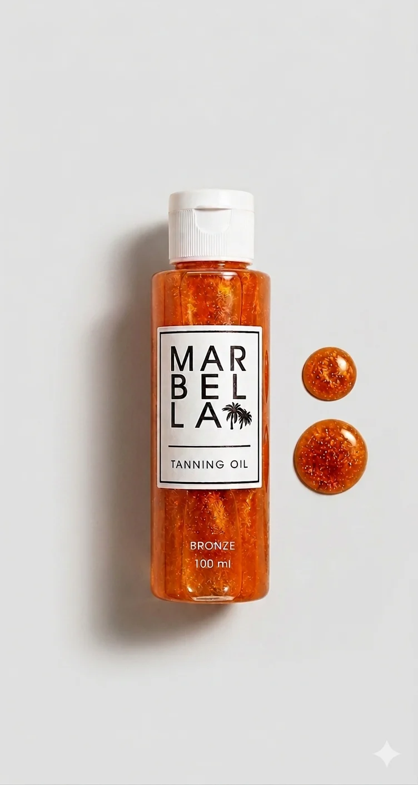

<div align="center">
  
</div>

# Marbella Tan

**Luxury tanning products website powered by Next.js, Tailwind CSS, and modern React tooling.**

---

## 🌐 Live Site

https://marbella-tan.vercel.app

---

## 🚀 Technology Stack

- **Next.js 16.2.9** — App Router, metadata, and server/client components
- **React 19** — UI rendering and interactivity
- **TypeScript** — typed code for safety and clarity
- **Tailwind CSS** — utility-first styling
- **motion** — animations and page transitions
- **Firebase** — authentication and user profile state
- **Zustand** — client-side cart and wishlist state
- **React Query** — async data fetching and caching
- **Sonner** — toast notifications
- **Three.js / @react-three/fiber** — optional 3D product viewer

---

## 📁 Project Structure

- `src/app/`
  - `page.tsx` — homepage
  - `shop/page.tsx` — shop/product listing
  - `about/page.tsx` — about page
  - `faq/page.tsx` — FAQ page
  - `contact/page.tsx` — contact page
  - `cart/page.tsx` — shopping cart
  - `profile/page.tsx` — user dashboard/profile
  - `products/[slug]/page.tsx` — dynamic product detail pages
  - `layout.tsx` — root layout and shared metadata
  - `providers.tsx` — app-level providers for auth, currency, query state
  - `sitemap.ts` — sitemap generation
  - `robots.ts` — robots.txt generator
  - `manifest.ts` — PWA manifest

- `src/components/`
  - `layout/` — shared layout components like `Navbar` and `Footer`
  - `shared/` — reusable UI pieces such as `ProductCard`, `InfiniteCarousel`, `Product3DViewer`
  - `ui/` — design system atoms like `Button`, `Badge`, `StarRating`

- `src/features/`
  - `auth/` — auth UI and user settings
  - `cart/` — shopping cart drawer
  - `search/` — search overlay

- `src/hooks/` — custom React hooks
- `src/lib/` — utilities and query client setup
- `src/services/` — API and Firebase service functions
- `src/utils/` — helpers, i18n, currency, translation
- `public/` — static assets and media files

---

## 🧭 Routes

- `/`
- `/shop`
- `/about`
- `/faq`
- `/contact`
- `/cart`
- `/profile`
- `/products/[slug]`
- `/api/exchange-rates`

---

## 📦 SEO and Metadata

This app includes the following SEO configuration:

- `src/config/metadata.ts` — global metadata, Open Graph, Twitter Card, robots, and canonical URL
- `src/app/layout.tsx` — root layout with schema markup injection
- `src/app/sitemap.ts` — sitemap generation for static and dynamic pages
- `src/app/robots.ts` — robots.txt rules referencing the deployed site URL
- `src/app/manifest.ts` — web manifest for PWA support
- `src/constants/index.ts` — site URL, site name, and description constants

---

## 🖼 Visual Assets

- `public/logo-green.png`
- `public/brown.webp`
- `public/red.webp`
- `public/orange.webp`
- `public/beach-pannel.mp4`

---

## 🛍 Featured Product Visuals

<div align="center">
  
  
  
</div>

---

## 📌 Deployment

Install dependencies and run locally:

```bash
pnpm install
pnpm dev
```

Build for production:

```bash
pnpm build
pnpm start
```

Deploy on Vercel for automatic static asset serving and serverless support.

---

## 🔧 Environment Variables

Copy `.env.example` to `.env.local` and set the values:

- `NEXT_PUBLIC_APP_URL`
- `NEXT_PUBLIC_APP_NAME`
- `NEXT_PUBLIC_APP_DESCRIPTION`
- `NEXT_PUBLIC_WHATSAPP_NUMBER`
- `NEXT_PUBLIC_WHATSAPP_MESSAGE`
- `NEXT_PUBLIC_AI_ENABLED`
- `NEXT_PUBLIC_SITE_LOCALE`
- `NEXT_PUBLIC_EXCHANGE_RATE_API_KEY`

---

## 💡 Notes

- The site uses a shared currency provider and language provider for localization.
- `public/beach-pannel.mp4` is served directly from the public folder.
- `manifest.json`, `robots.txt`, and sitemap generation are already wired into the app.
